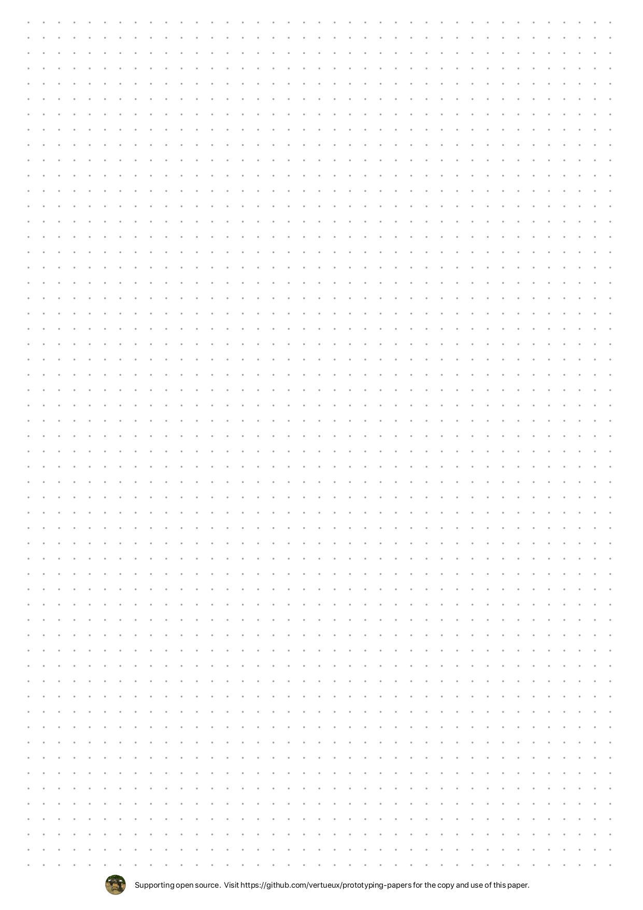
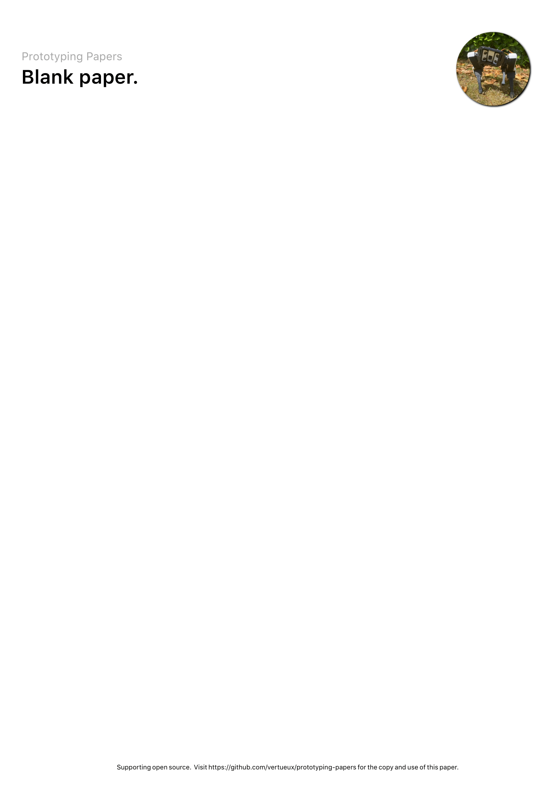
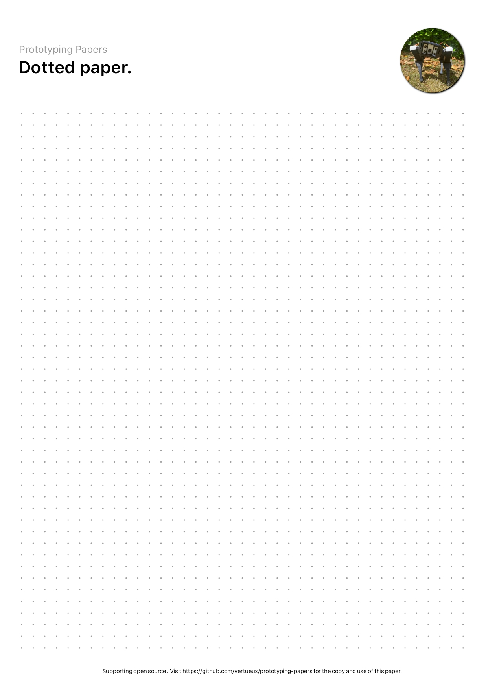

<h1 align="center">
  Prototyping Papers
</h1>

Prototyping Papers is a set of LaTeX papers designed to help you write notes, small documents, memos, etc. All A4 templates are ready to download and print, via the `preview/` folder.

The simplicity of the programming done on these files makes them highly customizable and can be easily adapted to your wishes.

## Compile the LaTeX files

To build the files yourself, you'll need a LaTeX edition with font support (notably XeLaTex). That's why I recommend using Overleaf to edit and compile programs from the web. All you have to do is clone the GitHub repository from the site.

## Available papers

These are the papers you can edit and directly use at the moment.

| Paper    | Description |
| -------- | ------- |
|   | Basic dotted paper is a simple paper, with no predefined text, no big GitHub profile picture taking up unnecessary space. It's designed to be simple and neutral.    |
|     | This is the most basic paper to use. Just a blank paper.    |
|  | In the same style as blank paper, dotted paper is a simple paper with dots for ease of use and geometry.  |

